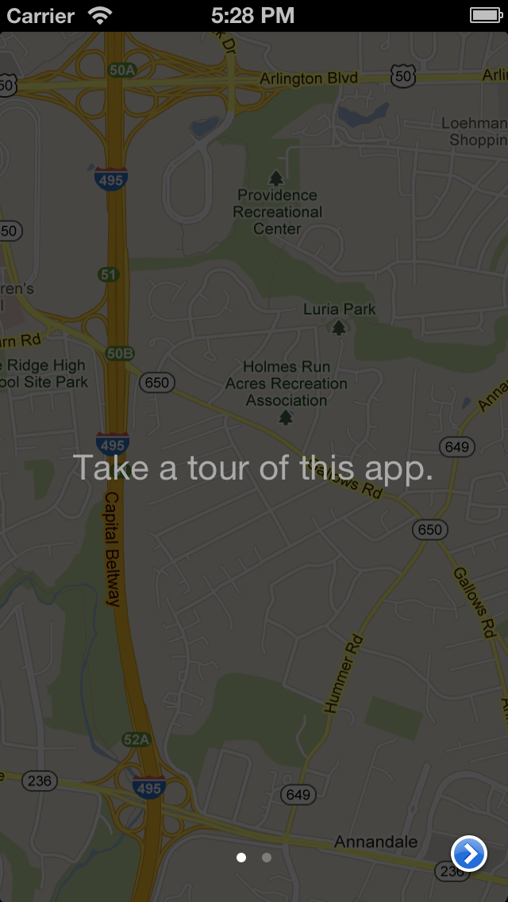
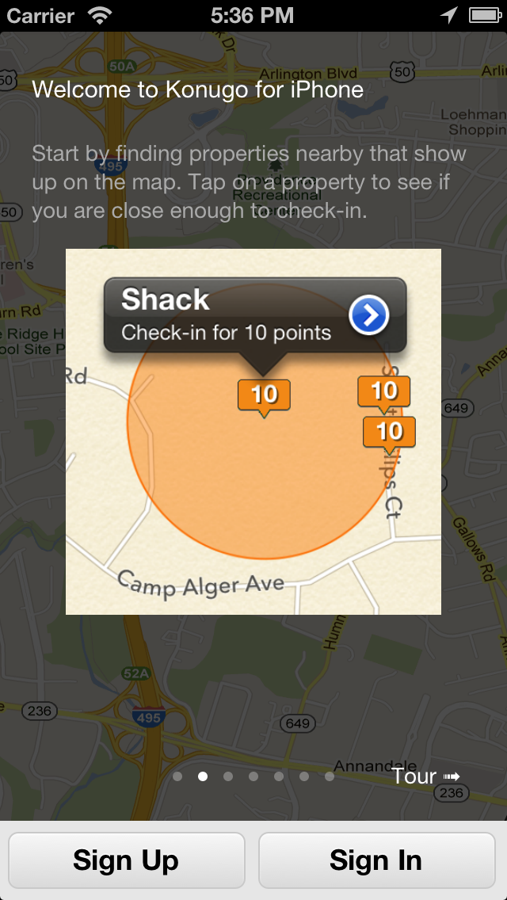

## LAWalkthrough

LAWalkthrough is a view controller class for iOS designed to simplify the creation of the walkthrough design pattern.
This code was inspired in April, 2013 by the screenshots displayed at http://www.mobile-patterns.com/walkthroughs
by Mari Sheibley.

It is simple to use and requires very little code to implement a nice looking walkthrough. It uses UIPageControl
and UIScrollView and is easy to subclass for customization.

## How To Get Started

- [Download LAWalkthrough](https://github.com/LarryAasen/LAWalkthrough/zipball/master) from [GitHub](http://github.com).
- Questions? [Stack Overflow](http://stackoverflow.com/questions/tagged/lawalkthrough) is the best place to find answers


## Example Usage

### Display a walkthrough with text views and a background image

``` objective-c
// Create the walkthrough view controller
LAWalkthroughViewController *walkthrough = LAWalkthroughViewController.new;
walkthrough.view.frame = self.view.frame;
walkthrough.backgroundImage = [UIImage imageNamed:@"tour-bg@2x"];

// Create pages of the walkthrough
[walkthrough addPageWithBody:@"Take a tour of this app."];
[walkthrough addPageWithBody:@"Thanks for taking this tour."];

// Use the default next button
walkthrough.nextButtonText = nil;

// Add the walkthrough view to your view controller's view
[self addChildViewController:walkthrough];
[self.view addSubview:walkthrough.view];
```

Screenshot from this example:<br>


<p></p>

### Display a walkthrough with XIB views and a background image

``` objective-c
// Create the walkthrough view controller
LAWalkthroughViewController *walkthrough = LAWalkthroughViewController.new;
walkthrough.view.frame = CGRectMake(0, 0, self.view.frame.size.width, self.view.frame.size.height-50);
walkthrough.backgroundImage = [UIImage imageNamed:@"tour-bg1@2x"];

// Create pages of the walkthrough from XIBs
[walkthrough addPageWithNibName:@"TourView1" bundle:nil]; // no need for a view controller
[walkthrough addPageWithNibName:@"TourView2" bundle:nil]; // no need for a view controller
[walkthrough addPageWithNibName:@"TourView3" bundle:nil]; // no need for a view controller

// Use text for the next button
walkthrough.nextButtonText = @"Next >";

// Add the walkthrough view to your view controller's view
[self addChildViewController:walkthrough];
[self.view addSubview:walkthrough.view];
```

Screenshot from this example:<br>


<p></p>

## Requirements

LAWalkthrough 1.0 and higher requires iOS 6.0 and above.

### ARC

LAWalkthrough uses ARC as of its 1.0 release.

If you are using LAWalkthrough 1.0 in your non-arc project, you will need to set a `-fobjc-arc` compiler flag on all of the LAWalkthrough source files.

To set a compiler flag in Xcode, go to your active target and select the "Build Phases" tab. Now select all LAWalkthrough source files, press Enter, insert `-fobjc-arc` or `-fno-objc-arc` and then "Done" to enable or disable ARC for LAWalkthrough.

## Credits

LAWalkthrough was created by [Larry Aasen](https://github.com/larryaasen/) in the development of [Konugo for iPhone](http://www.konugo.com).

## Contact

Follow LAWalkthrough and Konugo on Twitter ([@Konugo](https://twitter.com/Konugo))

### Creators

[Larry Aasen](https://github.com/larryaasen)  
[@larryaasen](https://twitter.com/larryaasen)

## License

LAWalkthrough is available under the MIT license. See the LICENSE file for more info.
